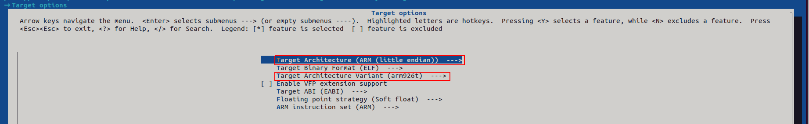
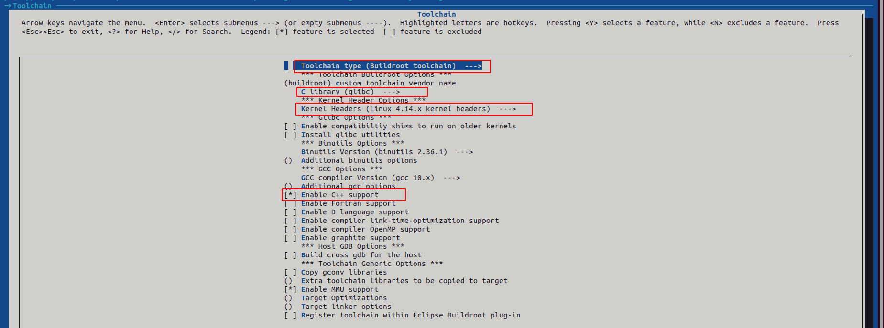

<h1>
Buildroot for F1C100S Processer from Allwinner
</h1>

Visit https://ohmbedkernel.substack.com/ to read more articles about F1C100S

<h2>
1. Install the necessary library packages
</h2>

```bash
sudo apt update
sudo apt install -y build-essential
sudo apt install -y libusb-1.0-0-dev zliblg-dev
sudo apt install -y pkg-config
sudo apt install -y python python3 python-dev python3-dev
sudo apt install -y swig
sudo apt install -y libncurses-dev libncurses5-dev
sudo apt install -y libssl-dev
sudo apt install -y kpartx
sudo apt install -y mtd-utils
```

<h2>
2. Download buildroot 2022.2 source
</h2>

```bash
git clone https://github.com/QuangPhuoc1998/250420-F1C100S-Builroot-2022.02.git
cd 50420-F1C100S-Builroot-2022.02
```

<h2>
3. Config buildroot
</h2>

```bash
make menuconfig

Select "Target options"
-> Target Architecture (ARM (Litte endian))
-> Target Architecture Variant (arm926t)
```



```bash
Select "Toolchain"
-> Toolchain type (Buildroot toolchian)
-> C library (glibc)
-> Kernel Headers (Linux 4.14.x kernel headers)
-> Enable C++ support
```



<h3>
Save, exit and run make to build the toolchain and rootfile system
</h3>

```bash
make -jx
# where x is the number of threads your computer can run.
```

<h2>
4. Output
</h2>

<h4>
After the build is completed, you will have the toolchain and rootfile system, check at location:<br>
Toolchain: /250420-F1C100S-Builroot-2022.02/output/host/bin/<br>
Rootfile system: /250420-F1C100S-Builroot-2022.02/output/images/<br>
</h4>

<h2>
5. How to use the toolchain
</h2>
<h4>
Run the command below to export the path to your system.
</h4>

```bash
export ARCH=arm
export CROSS_COMPILE=arm-buildroot-linux-gnueabi-
export PATH=$PATH:~/250420-F1C100S-Builroot-2022.02/output/host/bin/
```